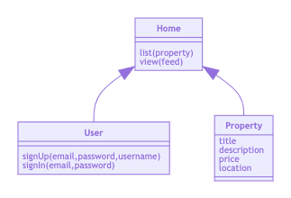
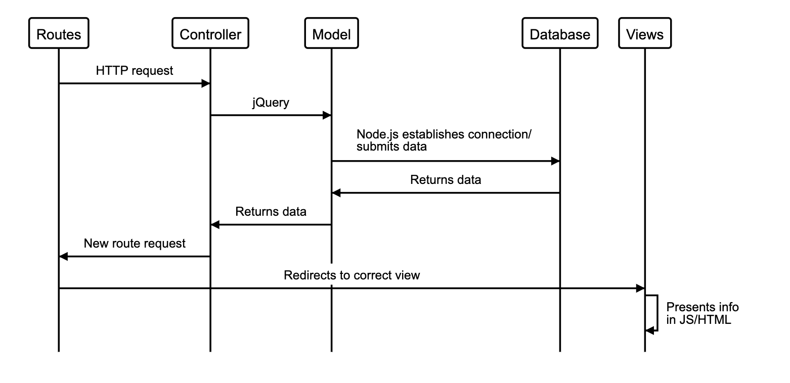
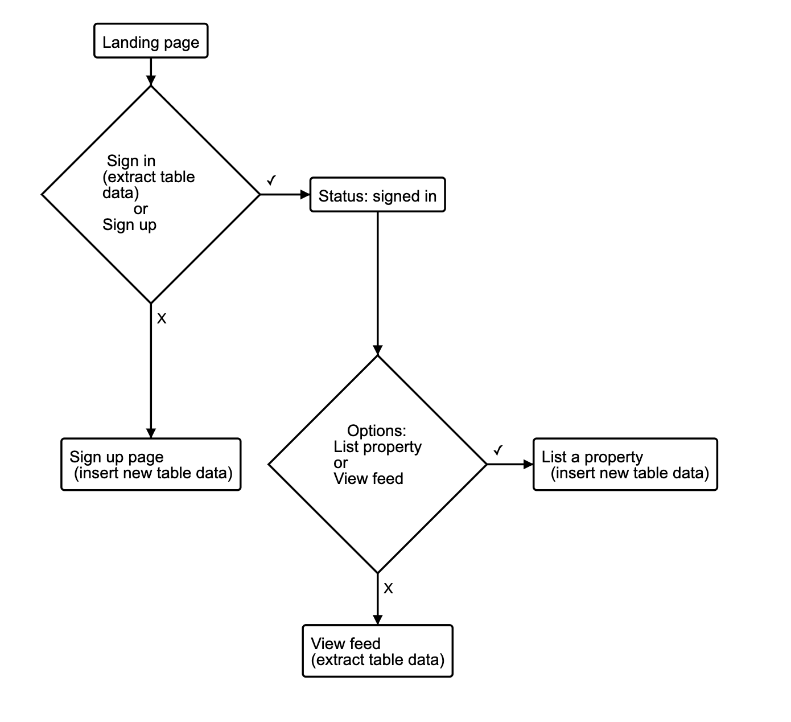

# MakersBnB

## [Team](https://github.com/sofyloafy/MakersBnb#team) - [Getting Set Sp](https://github.com/sofyloafy/MakersBnb#gettingsetup) - [Spec](https://github.com/sofyloafy/MakersBnb#spec) - [User Stories](https://github.com/sofyloafy/MakersBnb#userstories) - [Models](https://github.com/sofyloafy/MakersBnb#models) - [Approach](https://github.com/sofyloafy/MakersBnb#approach) - [Technologies Used](https://github.com/sofyloafy/MakersBnb#technologiesused) - [Future Developments](https://github.com/sofyloafy/MakersBnb#)

## Team
* [Sophie Brown](https://github.com/sofyloafy)
* [Victor Vallet](https://github.com/victorvallet)
* [Joshua Brook](https://github.com/joshuaabrookuk)
* [Benedetta Arinci](https://github.com/benearinci)

## Getting set up
First, clone this repository and ensure you have node.js and npm installed. Then:

```
- Install jest package: $ npm install --save-dev jest
- Install dontenv package: $ npm install dotenv
- Install bodyParser package: $ npm install body-parser
- Change the user in ./database/queries to your own username
- Launch the server: $ node server.js
- Navigate to browser and open at 'http://localhost:4000/'
- Run tests: $ npm test
```

To setup the database, connect to psql and run the following command:
```bash
CREATE DATABASE makers_bnb;
```
To setup the test database, connect to psql and run the following command:
```bash
CREATE DATABASE test_makers_bnb;
```

To set up the table, navigate to your databases and run the following command:
```bash
CREATE TABLE properties;
```


## Spec
We would like a web application that allows users to list spaces they have available, and to hire spaces for the night.

Headline specifications:
* Any signed-up user can list a new space.
* Users can list multiple spaces.
* Users should be able to name their space, provide a short description of the space, and a price per night.
* Users should be able to offer a range of dates where their space is available.
* Any signed-up user can request to hire any space for one night, and this should be approved by the user that owns that space.
* Nights for which a space has already been booked should not be available for users to book that space.
* Until a user has confirmed a booking request, that space can still be booked for that night.


## User Stories

```
As a signed up host, So I can make good use of an extra room, 
I would like to be able to list it as a new space.
```

```
As a signed up host, So I can personalize each listing, 
I would like to be able to provide a name, a short description,
and a price per night to my spaces.
```

## Models
We decided to model our approach for the MVP, and the domain model below 
demostrates what we would have liked to achieve, had time permitted.
The responsibilities have been shared amongst the class in order to comply with SRP.




The diagram below demonstrates the MVC overview of the data flow for viewing properties:


In addition, we modelled the user experience through the page, and the landing log in page that welcomes them.
Had time permitted, we would have had a login page with a user database, which then leads them to a personalised homepage, displaying properties, with an option to list a further property. Modelled below:



## Approach & Values
This week offered groups the opportunity to tackle a MakersBnB challenge in any way that the teams saw fit. Largely, the options were to write the entire app in Ruby/ Sinatra, or to divide the backend and front end with a Ruby/ JS split.

We decided to bypass both options, and focus on learning. We decided to eschew the MakersBnB final product vision, and attempt to create a small app with Node.js. 

Our priorities and values this week:
* To be a better dev than yesterday :heavy_check_mark:
* To push past comfort zones :heavy_check_mark:
* Set stretch goals every day :heavy_check_mark:
* To maintain team morale and good mental health :heavy_check_mark:
* To learn more on Node.js and how to test it :heavy_check_mark:

Team communication throughout the week has remained the biggest project, and ensures that any learnings are shared.

## Technologies Used
* JavaScript
* Node.js
* Jest testing framework
* PostGres
* HTML & CSS
* Dotenv

## Future Developments
We acknowledge our greatest flaw in this project is the lack of finished MVP. This was a values-driven decision that we made at the beginning of the week, to reflect our priority of learning over a rushed finished product.

Regardless of this acknowledge, here our future developments to overcome shortcomings:
* Shift from learnings-focused approach to initialize project to a results-focused approach to finish the product.
* Incorporate CSS to aid in the profile of a functioning webapp.
* Include feature tests to ensure that database connections are being tested dynamically, rather than with static variables.
